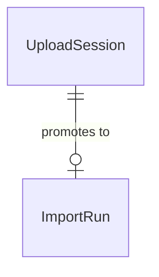

# ms-upload — domain

Aggregates, value objects, invariants and schema. Endpoints: `API.md`. Messaging: `EVENTS.md`.
Shared VOs (`Cbu`, `Money`, `UserId`): parent `.ai/references/APP_STRUCTURE.md`.

## Aggregates

| Aggregate | Root entity | Owned entities / VOs | Repository | Key invariant |
|---|---|---|---|---|
| ImportRun | `ImportRun` | `ReconciliationResult`, `FileHash` | `ImportRunRepository` | Unit of bulk import; tracks `FileHash` (SHA-256) for dedup; status transitions (`IN_PROGRESS` → `COMPLETED` / `PARTIAL` / `FAILED` / `UNDONE`); unique active hash per user |
| UploadSession | `UploadSession` | — | `UploadSessionRepository` | Transient mapping from `tempKey` UUID to user and file path during preview phase |

## Value objects

| VO | What it wraps | Validation it enforces |
|---|---|---|
| `ImportRunId` | Long aggregate ID | Positive non-null ID |
| `FileHash` | SHA-256 hash string of raw file | Exactly 64 hex characters |
| `ReconciliationResult` | Summary of expected vs calculated transactions | `importedCount`, `skippedCount`, `totalAmount` |
| `ColumnMapping` | Configurable CSV column indexes & formats | Required column indexes non-null |

## Enumerations

| Enum | Values | What decides the value |
|---|---|---|
| `FileType` | `BANK_PDF`, `VISA_PDF`, `CSV` | Selected by user on statement upload preview |
| `ImportRunStatus` | `IN_PROGRESS`, `COMPLETED`, `PARTIAL`, `FAILED`, `UNDONE` | Set by import execution outcome and undo operations |
| `TransactionType` | `DEBIT`, `CREDIT` | Parsed from statement row |

## Domain services

| Service | The single decision it owns |
|---|---|
| `ConfirmImportUseCase` | Orchestrates hash dedup, transaction forwarding to ms-finances, reconciliation computation, and MinIO file relocation |
| `UndoImportUseCase` | Reverses an import run by deleting created transactions in ms-finances and marking run `UNDONE` |

## ERD

## Schema `upload`

| Migration | What it adds |
|---|---|
| V1 | Initial `statement_imports` and `files` tables |
| V2 | Adds `original_name`, `file_hash`, `bank_id`, `account_id`, `card_id`; unique index on `(user_id, file_hash)` |
| V3 | `upload_sessions` table (keyed by `temp_key`) |
| V4 | `import_runs` table + partial unique index on active `(user_id, file_hash)` (`WHERE status <> 'UNDONE'`) |
| V5 | `import_run_transactions` table (normalized created transaction IDs) |
| V6 | Drops legacy `files` table and orphan columns |
